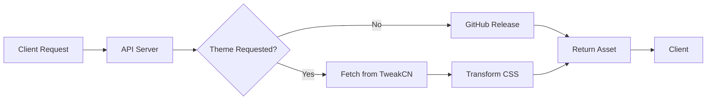

# Coolify Tweaks API

A simple API server that delivers [Coolify Tweaks](https://github.com/techwithanirudh/coolify-tweaks) releases with [TweakCN](https://tweakcn.com) theme integration. Makes it easy to get themed stylesheets without dealing with GitHub's CDN quirks.

## Why this exists

Ever tried to use custom themes with Coolify Tweaks and ran into CORS issues or CDN restrictions? Yeah, it's annoying. This API fixes that by:

- **Bypassing CDN limitations** - Direct access to release assets without the headaches
- **Dynamic theme injection** - Automatically applies TweakCN themes to your stylesheets
- **Edge-powered delivery** - Fast global performance with Vercel's edge runtime
- **Smart caching** - Proper headers and optimized delivery

## Quick Start

### For Users
Want the latest Coolify Tweaks with a custom theme? Just grab it:

```bash
# Get the latest release with default styling
curl "https://tweaks-api.yourdomain.com/api/release/latest"

# Apply a theme from TweakCN
curl "https://tweaks-api.yourdomain.com/api/release/latest?theme=claude"

# Get a specific asset
curl "https://tweaks-api.yourdomain.com/api/release/latest?asset=coolify-tweaks.zip"
```

### For Developers
```bash
# Clone and setup
git clone <your-repo>
cd coolify-tweaks-api

# Install dependencies
bun install

# Start development server
bun run start

# Deploy to Vercel
bun run deploy
```

## API Reference

### Get Release Asset
```http
GET /api/release/:tag
```

**Query Parameters:**
- `asset` - Asset filename (default: `main.user.css`)
- `theme` - TweakCN theme ID for CSS transformation

**Examples:**
```bash
# Latest release with default asset
GET /api/release/latest

# Specific version
GET /api/release/v1.2.0

# Custom asset
GET /api/release/latest?asset=installer.js

# With TweakCN theme (this is where the magic happens)
GET /api/release/latest?theme=claude&asset=main.user.css

# Download as zip
GET /api/release/latest?asset=coolify-tweaks.zip
```

### Health Check
```http
GET /api/health
```
Returns service status and basic info.

### API Information
```http
GET /api/
```
Lists all available endpoints and usage.

## Theme Integration

The cool part is when you combine Coolify Tweaks with TweakCN themes:

1. **Request with theme**: Add `?theme=<theme-id>` to your CSS requests
2. **Automatic processing**: The API fetches the theme from TweakCN registry
3. **CSS transformation**: Theme variables get injected into the stylesheet
4. **Seamless delivery**: You get a themed CSS file ready to use

**Available themes**: Browse [TweakCN](https://tweakcn.com/themes) for theme IDs.

## How It Works



1. **Request comes in** with optional theme parameter
2. **GitHub asset fetched** from the latest release
3. **Theme applied** (if requested) by fetching CSS variables from TweakCN
4. **CSS transformed** using PostCSS for clean integration
5. **Response sent** with proper caching headers

## Configuration

The API is set up for the `techwithanirudh/coolify-tweaks` repository, but you can customize:

- **Target repository**: Edit the owner/repo in `api/index.ts`
- **Default asset**: Change the default filename
- **Custom processing**: Extend the CSS transformation logic

## Deployment

### One-Click Deploy
[](https://vercel.com/new/clone)

### Manual Deploy
```bash
# Using Vercel CLI
vercel deploy

# Or push to main branch for auto-deployment
git push origin main
```

## Contributing

Have ideas for improvements? Cool, we'd appreciate the help!

1. Fork the repository
2. Create your feature branch: `git checkout -b my-new-feature`
3. Make your changes and test them
4. Commit: `git commit -am 'Add some feature'`
5. Push: `git push origin my-new-feature`
6. Submit a pull request

## License

This project is licensed under the MIT License - see the [LICENSE](LICENSE) file for details.

## Acknowledgments

- **[Coolify](https://coolify.io)** - The amazing self-hosting platform this enhances
- **[TweakCN](https://tweakcn.com)** - Beautiful theme system integration
- **[Vercel](https://vercel.com)** - Edge runtime hosting
- **Community** - Everyone using and improving Coolify Tweaks

---

<div align="center">
  <strong>Made with love for the Coolify community</strong><br>
  <a href="https://github.com/techwithanirudh/coolify-tweaks">Coolify Tweaks</a> • 
  <a href="https://tweakcn.com">TweakCN</a> • 
  <a href="https://coolify.io">Coolify</a>
</div>